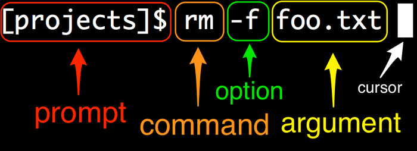

# WildIris HPC Tutorial


## Under active development!!!


This tutorial will walk through the basics of the WildIris high-performance computing (HPC) cluster that is hosted at the University of Wyoming (UW). This cluster is specifically implemented to support users outside of UW and does not require UW credentials/email for access.

If you are looking at this tutorial, then I'm assuming that you already have login credentials that were provided by UW's Advanced Research Computing Center (ARCC -- my sincere apologies for all the acronyms, I hate 'em, too). 


## Table of contents:


## Logging in

Logging into WildIris follows the same general procedure as logging into most remote servers. If you are on a Mac or running a Linux operating system, then you can log in directly from the terminal. If you are on a Windows machine, you will need to install an ssh client to allow you to log into and communicate with WildIris, such as [MobaXterm ](https://mobaxterm.mobatek.net/download.html) or [PuTTY](https://www.putty.org/).


Detailed instructions for logging into WildIris are described on ARCC's site [here](https://arccwiki.atlassian.net/wiki/spaces/DOCUMENTAT/pages/1566048281/Connecting+to+WildIris). We'll assume that you've completed your first login. At this point, on a Mac or Linux, you can open a terminal window, type 

`ssh <username>@wildiris.arcc.uwyo.edu`

(where <username> should be replaced by your username on the system)

Then when prompted for a password, enter your password. You will then be asked for a second password: enter the code provided by the FreeOTP app.

This will work basically the same in MobaXterm or PuTTY, but you will put `<username>@wildiris.arcc.uwyo.edu` into the hostname/session window instead of entering it on the command line.

If you've correctly entered your password and FreeOTP code, you should now be logged into WildIris. Keep in mind that as you enter your password, there will be no indication that you've typed anything, you won't see `******` as you might on a website.


## Navigating WildIris

The WildIris cluster runs a Linux operating system, as do the vast majority of other HPC clusters. Linux is similar to the Unix-based operating system used on Mac computers. A major difference between using WildIris (and other clusters) and desktop or laptop that is running a Linux or Mac operating sytem is that we have no graphical interface or desktop when we log in to WildIris. Instead, we interact primarily via the command line (for some tools that are exceptions to this, see info about Southpass and Cyberduck below).

This means that we can't just click our way around the cluster to get where we want or see what files and programs are available. Instead, we have to learn some commands that we can use to accomplish these tasks. Commands are entered into the command line in the terminal, and generally share a common structure:



Note that your prompt will look different from mine because I have changed some options in my bash profile (don't worry if that doesn't make much sense to you), and the prompt will look different on different clusters.

One of the most common commands you'll use is 

`ls`

This command lists files and directories. If you run it with no options or arguments, it will do this for the directory you are currently in. 

**Commands are case sensitive!** If you type `LS` it will not be recognized as `ls`. Spaces between options/arguments are also important to delineate when a new option or argument starts. In most cases, the number of spaces is not critical, but it can be for some applications.

When you first log in, you'll be in your home directory, you can always confirm your current directory with the

`pwd`

command (for "print working directory"). This will show you the full path to where you are currently, i.e., all of the nested directories that you are inside of. You should do this often to make sure you're working where you think you are!

If you haven't been using WildIris yet, then you likely won't have any files to see when you run `ls`. We can use `touch` to create a blank text file in our current directory.

```
touch test.txt
```

Here we have to supply an argument to `touch` to tell it what to name the file. If we run `ls`, we should now see what file listed. I personally prefer to always run `ls` with some additional options as 

`ls -ltrh`

where `l` is long form (includes date information, owner, permissions, and size), `tr` is sort by time, and in reverse (newest files at the bottom), and `h` is human readable so that file sizes are in KB, MB, GB, etc instead of always in bytes.

You can move around on the cluster using `cd` followed by any path (or if you enter `cd` with no path, it will take you to your home directory). If you run

```
cd /
```

It will take you to the root directory of the server. If you run `ls` or `ls -ltrh` here, you'll see all the directories and files that exist in that directory - you won't have permissions to modify most of these and may not be able to even view some. You can return to your home directory by typing `cd`, `cd ~` (the tilde is a shortcut for your home directory), or `cd` followed by the full path to your home directory.

Once back in your home directory, make a new directory called "t3_2022" using the `mkdir` command to make a directory:

```
mkdir t3_2022
```

Then navigate into it:

```
cd t3_2022
```

Note that here we didn't have to use the full path, only what's called the "relative path", meaning we tell the computer where to go relative to where we are already. If we ran that command from somewhere else, it wouldn't work, because the computer doesn't know where to look for `t3_2022`. You can think of this like addresses. If we're in Laramie and I say to go to 108 Grand Ave (Coal Creek Tap), the directions make sense relative to us being in Laramie already. If we're in Ft. Collins, CO, that address doesn't exist, and you need to provide the full address for anyone to be able to get there.

We can navigate up one directory from wherever we are by using `..`

`cd ..`

This can be chained together to move up two or more directories: `cd ../..` goes up two directories, `../../..` goes up three. This can be a bit confusing, so you may want to `pwd` when you finish to know where you are.


Note that if you just want to see what's inside some directory, you can use `ls` without moving into that directory first:


```bash
# List the contents of your home directory
ls ~

# list contents of one directory up from where you are
ls .. 

# list the contents of the root directory
ls /

# list the contents of the t3\_2022 directory you made in your home directory

ls ~/t3_2022
```


## Moving, copying, and removing (deleting) files

The **move** command - mv

  + mv \<file> \<destination>

The **copy** command - cp

  + cp \<file> \<destination>

The **remove** command - rm

  + rm \<file>

```bash
# make a new directory
mkdir my_directory/

# move a file up one directory
mv my_file.txt ../

# move and rename a file
mv my_file.txt ../my_renamed_file.txt

# copy a file and rename
cp my_file.txt my_renamed_file.txt

# copy a file to a different directory without renaming
cp my_file.txt my_directory/

# remove a file
rm my_renamed_file.txt

# remove a directory with the -r option, recursive
rm -r my_directory/
```


Be **VERY** careful when using `rm`, and even `cp` and `mv`. There is no "undo" button on the command line in Linux and no trashcan. If you delete something with `rm`, it is **gone** and it will not warn you or ask you if you're sure. Similarly, `cp` or `mv` will happily overwrite the target destination with no warning if it already exists.

### Finding help for a command

You can find helpful information about these and most other commands by typing `--help` after the command, e.g., `ls --help` will give you a whole lot of info about using `ls`. Most commands also have great documentation and tutorials that can be found with some quick googling.


## Transferring files to and from WildIris

At some point, you will need to upload data from your local computer to WildIris or download data/results from WildIris onto your local computer. There are a few ways to do this. `rsync` and `scp` are both commands that allow you to transfer files over a secure connection. You can find some good scp documentation [here]( https://linuxize.com/post/how-to-use-scp-command-to-securely-transfer-files/) and rsync documentation [here](https://www.digitalocean.com/community/tutorials/how-to-use-rsync-to-sync-local-and-remote-directories#using-rsync-to-sync-with-a-remote-system).


I personally only use these when dealing with really large files or lots of files at a time. Instead, I generally prefer to use the program [Cyberduck](https://cyberduck.io/download/). You also cannot natively use `scp` pr `rsync` on Windows as far as I'm aware so will need Cyberduck or a similar program, like [Filezilla](https://filezilla-project.org/) or [WinSCP](https://winscp.net/eng/index.php).
 
 When you open Cyberduck, you should see an "Open Connection button". Click that, select "SFTP" in the dropdown box, enter `wildiris.arcc.uwyo.edu` as the server, then input your username and password. After clicking "connect", you should get a prompt for your second password, which is the code from the FreeOTP app.

If you've successfully logged in, you should see a file browser that looks like what you'd see on your desktop. Here you click around through files on WildIris. By default, double clicking a file will download it to your local computer. You can also right click, then select "edit with" to look at a file in any program that will edit it without needing to create a separate copy on your local machine. You can also drag and drop files and directories to and from WildIris using Cyberduck like a regular file browser window on your local machine.


## Compute nodes vs. login nodes

WildIris is comprised of many individual computers that are all linked together, each of which is called a **node**. Different nodes may have different properties and functions, such as varying numbers of cores (individual processors within a node) and different amounts of memory, you can see an overview of the nodes on WildIris [here](https://arccwiki.atlassian.net/wiki/spaces/DOCUMENTAT/pages/1554972900/WildIris). 

Most important for us most of the time is the distinction between **compute** and **login** nodes. There is a single login node on WildIris. As one might expect, this is the node that you land on when you log in. This node has a limited number of cores and memory, and should only be used for navigating around on the cluster, moving files around, basic text editing, etc. **Do not run computationally intensive processes on the login node**. These will fail or gum up the login node so that other users have a hard time using the cluster.

Instead, anything that is actually processing and analyzing data should be run on a compute node. We'll cover how to do this with interactive sessions and by using slurm job scripts.

### Interactive sessions

Starting an interactive session will move you from the login node onto a compute node, and then everything you enter on the command line will be run on the compute node instead of the login node. You will still enter all of your commands directly into the command line and navigate around as you have been so far. This is done with the `salloc` command.

`salloc` requires that you specify a project with the `-A` option so that usage and priority can be properly monitored. In the T3 2022 workshop, you should all be on the "wy\_t3_2022" project. If you are reading this guide from outside of this workshop, you will need to have use your own project instead. You will likely want to include additional options to specify the amounts of time, memory, and cores to allocate for your session.

This will start an interactive session for 3 hours (format is DAYS-HOURS:MINUTES:SECONDS) with 10 GB of memory and 2 cores.

```bash
salloc -A wy_t3_2022 -t 0-03:00 --mem=10G --cpus-per-task=2
```

Once your session is allocated and running, you can start running commands on the command line with the resources that you requested. If you are done with your session early, you can run `exit` to leave the interactive session and get back to the login node. If you are already on the login node `exit` will terminate your connection to WildIris.

Note that anything you run in an interactive session will terminate if your connection to WildIris is closed. Thus for longer tasks that you don't want to sit and stare at, you can submit a job to WildIris. This is done using a shell script to submit the job to SLURM, the program that schedules jobs on WildIris and many other clusters.

Such scripts start with a header of SLURM options, including how many resources to request, etc.:


```
#!/bin/bash

#SBATCH --job-name FQC   # give the job a name
#SBATCH -A wy_t3_2022    # specify the account
#SBATCH -t 0-04:00		 # how much time?
#SBATCH --nodes=1			# how many nodes?
#SBATCH --cpus-per-task=2	# 2 cores
#SBATCH --mem=10G			# 10 GB memory
#SBATCH --mail-type=ALL		# Send emails on start, fail, completion
#SBATCH --mail-user=USERNAME@gmail.com   # specify your email
#SBATCH -e err_fastqc_%A.err		# name error files and include job ID (%A)
#SBATCH -o std_fastqc_%A.out		# name standard out files and include job ID (%A)
```


That header is followed by the commands you wish to execute, then you submit a job using `sbatch <your_slurm_script>`.  We'll get deeper into this as we start running jobs in other tutorials, don't worry if this seems really compicated right now.


- Cyberduck image of open connection, etc.

	
- some info on SouthPass

- some stuff about ssh - rip from Joe's tutorial


this is a good template guide from Teton: https://microcollaborative.atlassian.net/wiki/spaces/DSC/pages/102563845/Teton+beginner+s+guide

Joe's bash tutorial: https://github.com/Joseph7e/HCGS-BASH-tutorial


